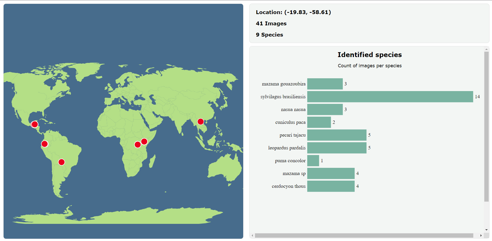

# Code for CSE 6242 project: Enhancing Wildlife Conservation with Deep Learning

This code utilizes the [Masked Autoencoder (MAE)](https://arxiv.org/abs/2111.06377) framework to finetune a classifier for detecting and labeling wildlife in camera trap images. 

The code is based in large part on the [original implementation](https://github.com/facebookresearch/mae/tree/main) by the MAE authors, and was modified appropriately for the purposes of this project. 

The code also has an interactive visualization component that allows a user to visualize wildlife population data at specific camera trap locations around the world, as shown below. 

